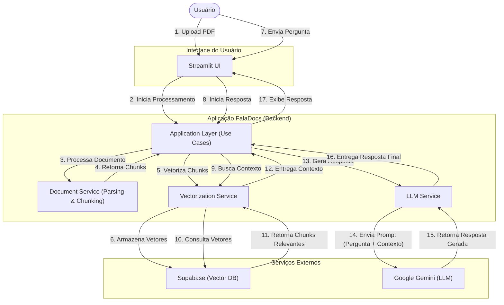

```mermaid
graph TD
    subgraph "Interface do Usuário"
        UI[Streamlit UI]
    end

    subgraph "Aplicação FalaDocs (Backend)"
        AppLayer["Application Layer (Use Cases)"]
        DocService["Document Service (Parsing & Chunking)"]
        VecService["Vectorization Service"]
        LLMService["LLM Service"]
    end

    subgraph "Serviços Externos"
        Supabase["Supabase (Vector DB)"]
        Gemini["Google Gemini (LLM)"]
    end

    User([Usuário]) -- "1. Upload PDF" --> UI
    UI -- "2. Inicia Processamento" --> AppLayer
    AppLayer -- "3. Processa Documento" --> DocService
    DocService -- "4. Retorna Chunks" --> AppLayer
    AppLayer -- "5. Vetoriza Chunks" --> VecService
    VecService -- "6. Armazena Vetores" --> Supabase

    User -- "7. Envia Pergunta" --> UI
    UI -- "8. Inicia Resposta" --> AppLayer
    AppLayer -- "9. Busca Contexto" --> VecService
    VecService -- "10. Consulta Vetores" --> Supabase
    Supabase -- "11. Retorna Chunks Relevantes" --> VecService
    VecService -- "12. Entrega Contexto" --> AppLayer
    AppLayer -- "13. Gera Resposta" --> LLMService
    LLMService -- "14. Envia Prompt (Pergunta + Contexto)" --> Gemini
    Gemini -- "15. Retorna Resposta Gerada" --> LLMService
    LLMService -- "16. Entrega Resposta Final" --> AppLayer
    AppLayer -- "17. Exibe Resposta" --> UI
```